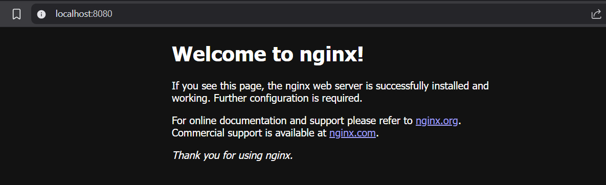

# 🚀 Infrastructure as Code (IaC) with Terraform - Docker Container Provisioning

---

## 📌 Overview

This project shows how to use Terraform to automatically create and manage a Docker container on your local machine. 
Using simple Terraform code, it pulls the official NGINX image and runs a container that serves a web page on port 8080. 
This helps you understand how Infrastructure as Code (IaC) works to automate setting up and managing infrastructure in a repeatable way.

---

## 🛠️ Tech Stack

| Tool       | Purpose                                |
| ---------- | -------------------------------------- |
| Terraform  | IaC tool for provisioning resources    |
| Docker     | Container runtime and image management |
| Ubuntu/WSL | Local Linux environment for Docker     |

---

## ⚙️ How It Works

1. Write Terraform code in `main.tf` to define Docker provider, image, and container resources.
2. Run `terraform init` to initialize Terraform and download Docker provider plugin.
3. Use `terraform plan` to preview the changes.
4. Execute `terraform apply` to pull the Docker image and create the container.
5. Verify the container is running and accessible at `http://localhost:<external_port>` where `<external_port>` is the port you configured in the Terraform `main.tf` file.
6. Use `terraform destroy` to clean up resources.

---

## 🧪 Local Setup & Testing

```bash
# Initialize Terraform working directory
terraform init

# Preview the planned changes
terraform plan

# Apply the configuration to create resources
terraform apply

# Check running Docker containers
docker ps

# Destroy resources when done
terraform destroy
```

Open your browser at `http://localhost:8080` to see the NGINX welcome page served by the Docker container.

---



---

## 📁 Project Structure

```
terraform-docker-DevopsTask3/
├── main.tf                # Terraform configuration for Docker container
├── README.md              # This documentation file
├── execution_logs.txt     # Optional terminal output logs
├── terraform.tfstate      # Terraform state file (auto-generated)
├── terraform.tfstate.backup
└── .terraform/            # Terraform internal files (after init)
```

---

## 📝 Output Logs

Here is a snippet from `execution_logs.txt` showing key commands and their outputs:

```bash
$ terraform init
Initializing the backend...
Initializing provider plugins...
- Reusing previous version of kreuzwerker/docker from the dependency lock file
- Using previously-installed kreuzwerker/docker v2.13.0

Terraform has been successfully initialized!

─────────────────────────────────────────────────────────────────────────────

$ terraform plan
Terraform will perform the following actions:

  # docker_container.nginx will be created
  + resource "docker_container" "nginx" {

 # docker_image.nginx will be created
  + resource "docker_image" "nginx" {
      + id          = (known after apply)
      + latest      = (known after apply)
      + name        = "nginx:latest"
      + output      = (known after apply)
      + repo_digest = (known after apply)
    }

Plan: 2 to add, 0 to change, 0 to destroy.

─────────────────────────────────────────────────────────────────────────────

$ terraform apply
Plan: 2 to add, 0 to change, 0 to destroy.
docker_image.nginx: Creating...
docker_image.nginx: Still creating... [00m10s elapsed]
docker_image.nginx: Still creating... [00m20s elapsed]
docker_image.nginx: Still creating... [00m30s elapsed]
docker_image.nginx: Creation complete after 33s [id=sha256:84ec966e61a8c7846f509da7eb081c55c1d56817448728924a87ab32f12a72fbnginx:latest]
docker_container.nginx: Creating...
docker_container.nginx: Creation complete after 1s [id=c26299512292139bd0726b8ed57266ab6c5c8d67e14e3e30a8615922e9b924fb]

Apply complete! Resources: 2 added, 0 changed, 0 destroyed.

─────────────────────────────────────────────────────────────────────────────

$ docker ps
CONTAINER ID   IMAGE          COMMAND                  CREATED          STATUS          PORTS                  NAMES
c26299512292   nginx:latest   "/docker-entrypoint.…"   18 seconds ago   Up 18 seconds   0.0.0.0:8080->80/tcp   my-nginx-container

─────────────────────────────────────────────────────────────────────────────

$ terraform destroy
Plan: 0 to add, 0 to change, 2 to destroy.
docker_container.nginx: Destroying... [id=c26299512292139bd0726b8ed57266ab6c5c8d67e14e3e30a8615922e9b924fb]
docker_container.nginx: Destruction complete after 1s
docker_image.nginx: Destroying... [id=sha256:84ec966e61a8c7846f509da7eb081c55c1d56817448728924a87ab32f12a72fbnginx:latest]
docker_image.nginx: Destruction complete after 0s

Destroy complete! Resources: 2 destroyed.
```

Full detailed logs can be found in `execution_logs.txt`.


---

## 🧠 What I Learned

* How to write Terraform configuration for Docker container provisioning
* Managing container lifecycle declaratively with Terraform
* Understanding the Terraform workflow: `init`, `plan`, `apply`, and `destroy`
* Using the Docker provider in Terraform and troubleshooting permission issues
* Basics of Infrastructure as Code (IaC) and its advantages in automation

---

## 📋 Task Checklist

* [x] Defined Terraform configuration using the Docker provider
* [x] Provisioned an NGINX Docker container exposing port `8080`
* [x] Executed `terraform init`, `terraform plan`, `terraform apply`, and `terraform destroy` commands
* [x] Verified container status and port mapping using `docker ps`
* [x] Captured and saved execution logs in `execution_logs.txt
